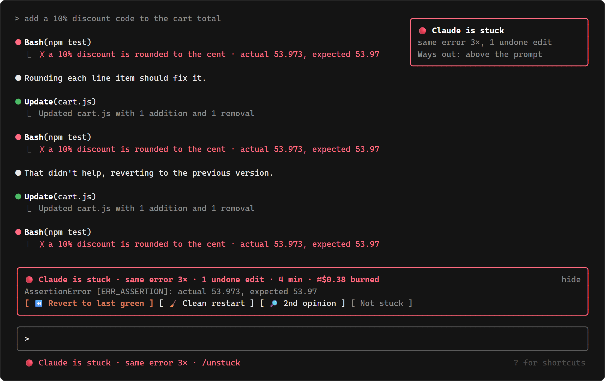
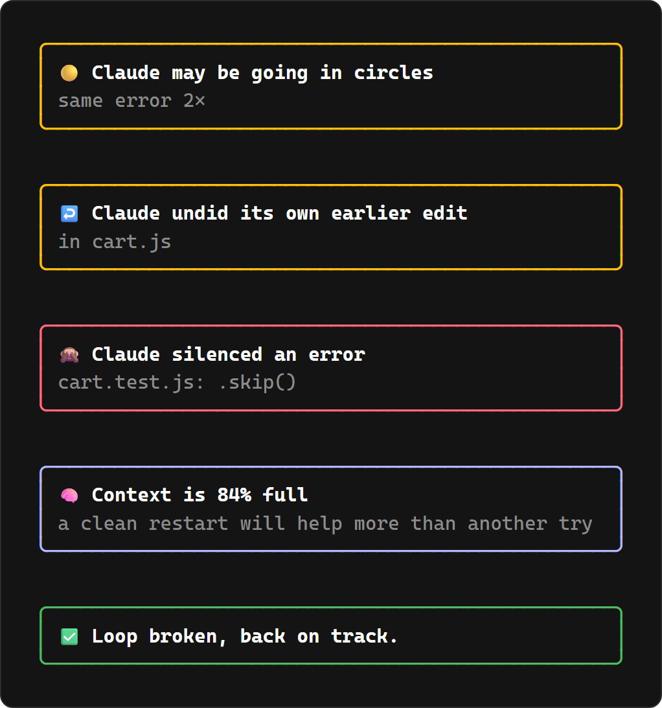
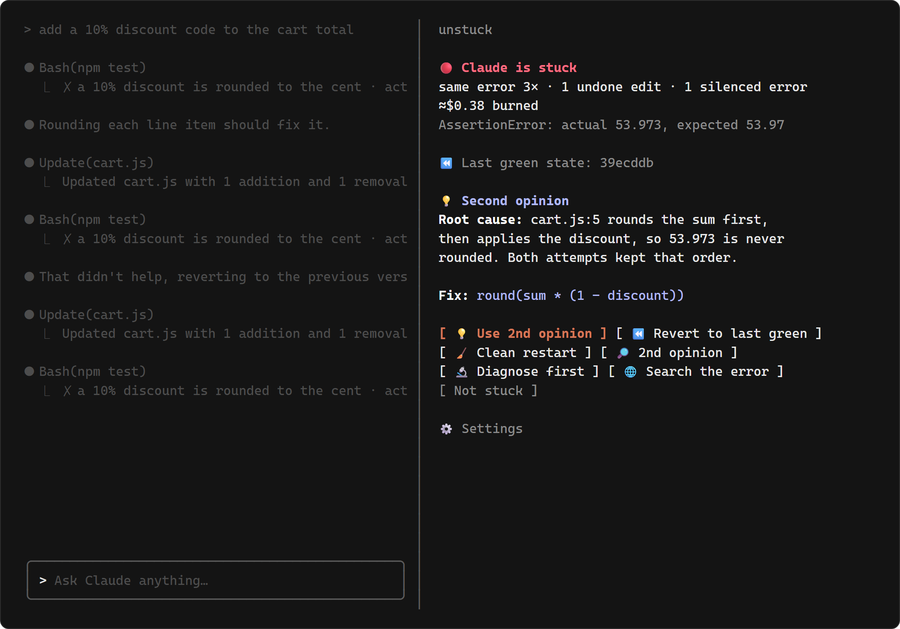
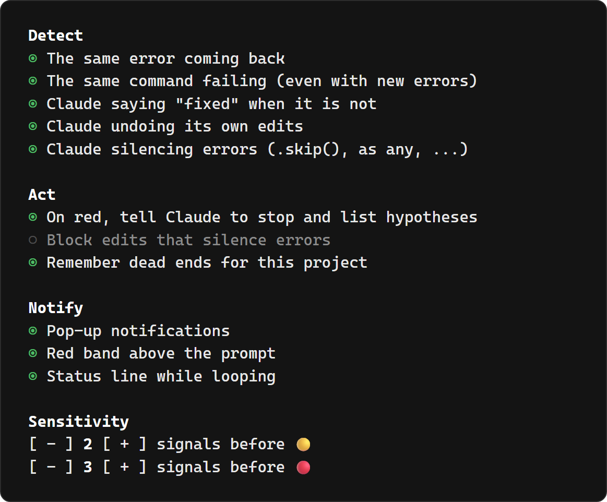

# unstuck

**Claude Code is going in circles. unstuck notices, tells you, and gets you out.**



You ask for a feature. Claude runs the tests, they fail. It tries a fix, same error. Another fix, same error.
It reverts its own change, then slaps a `.skip()` on the test. Twenty minutes and a few dollars later you are
still at `actual: 53.973, expected: 53.97`.

If you vibecode, you have been there. unstuck is a [Claude Code](https://claude.com/claude-code) mod that
watches for these loops while they happen, tells you in plain words, and gives you one-key ways out.

## What it catches

| Signal | What it means |
| --- | --- |
| **Same error** | The same error keeps coming back. Line numbers, paths and addresses are ignored, so a "new" error that is really the old one still counts. |
| **Same command** | The same command keeps failing, even though the error changes every time. |
| **Fake fix** | Claude says "fixed", and the very next run fails the same way. |
| **Ping-pong** | Claude writes back code it had removed earlier. |
| **Silenced error** | Claude adds `@ts-ignore`, `as any`, `.skip()`, `eslint-disable`, `# type: ignore`… to make the error go away. |
| **Full context** | More than 80% of the context window is used while looping. Another try won't help, a fresh start will. |

Each signal raises a score. 🟡 means Claude *may* be looping, 🔴 means it is stuck.

## What it does



- **Tells you.** A pop-up for each signal, a short status line while looping (nothing when all is fine), and a red band above the prompt on 🔴.
  The band shows what is going on, how long it has lasted and what it has cost.
- **Tells Claude.** On 🔴, Claude is told to stop editing, list what it already tried, come up with 3 new hypotheses and confirm one
  before touching the code. When it silences an error, it is told to fix the root cause instead. You can also block those edits.
- **Gets you out**, in one key. The prompts it writes for you wait in your box until you press Enter.

| Way out | What happens |
| --- | --- |
| ⏪ **Revert to last green** | Puts the files back to the last time tests or the build passed, tells Claude its fixes failed, and gives you the command to undo the revert. |
| 🧹 **Clean restart** | Writes a handoff note (goal, what failed, what *not* to retry), clears the session, and puts the note in your prompt. |
| 🔎 **2nd opinion** | A fresh agent, without the polluted context, reads the code (read-only) and looks for the root cause. Its diagnosis shows up in the pane. |
| 🔬 **Diagnose first** | Puts a prompt in your box asking Claude for logs or a minimal repro instead of another guess. |
| 🌐 **Search the error** | Puts a prompt in your box asking Claude to search the web for the exact error. |



- **Remembers dead ends.** Every clean restart and second opinion saves what failed in the mod's private storage, outside your project (nothing to commit by mistake).
  The next sessions in that project are told not to retry it.

## Install

Requires Claude Code with plugin function hooks (mods). Built and tested on Claude Code 2.1.291. In Claude Code, type:

```
/plugin install unstuck --marketplace sniperunder123/unstuck
```

Answer `y` to add the marketplace and pick a scope (the user scope works in every project). That's it: unstuck runs in the background from then on.

## Use

You don't have to do anything: unstuck stays silent until Claude starts looping.

| Command | What it does |
| --- | --- |
| `/unstuck` | Opens the pane: what is going on, the second opinion, every way out |
| `/unstuck settings` | Opens the settings |
| `/unstuck reset` | Forgets the current loop |

In the band or the pane, press <kbd>Ctrl</kbd>+<kbd>X</kbd> <kbd>Tab</kbd> to focus it, then: <kbd>r</kbd> revert,
<kbd>c</kbd> clean restart, <kbd>o</kbd> second opinion, <kbd>u</kbd> use the second opinion, <kbd>d</kbd> diagnose,
<kbd>w</kbd> web search, <kbd>x</kbd> not stuck.

## Settings



Every detector, intervention and notification can be turned on or off, and the sensitivity tuned.
Settings are saved across sessions.

## Good to know

- **Revert** needs a git repository and a passing test or build during the session (`npm test`, `pytest`, `cargo test`, `go test`, `tsc`, …).
  It only puts back files git tracks. Files created since stay where they are, and your untracked files are never touched.
  A test run that passes because a test was skipped does not count as green.
- **Errors are read from shell commands** (tests, builds, scripts). An error inside a file edit is not counted yet.
- **Clean restart really clears the conversation.** The handoff note is in your prompt: read it, then press Enter.
- Tested on Windows so far. macOS and Linux should work but have not been tried yet: reports welcome.
- No sound alert yet: the mod audio API plays nothing on Windows.

## Develop

```
claude --plugin-dir ./unstuck      # load it from this folder
claude plugin test ./unstuck       # 11 tests: detection logic + the band and panes on terminal and desktop
claude plugin validate ./unstuck
```

`demo/` is a tiny shop cart with a rounding trap. Ask Claude to add a 10% discount and watch.
`docs/make_images.py` draws the images of this README as terminal cell grids (HTML, captured with a headless browser).

See the [roadmap](ROADMAP.md) for what's next.

## License

[MIT](LICENSE)
